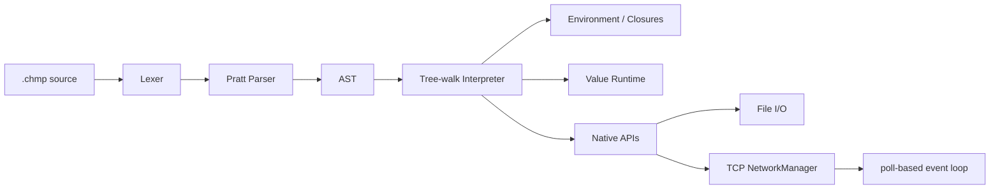

<div align="center">

# Chompo

### A dynamic language and tree-walk interpreter in C++23

[](https://en.cppreference.com/w/cpp/23)
[](https://cmake.org/)
[](https://github.com/Bony-Lord/ChompoC/actions/workflows/ci.yml)
[](LICENSE)


**Chompo** is a dynamically typed language with `.chmp` files, first-class functions, closures, mutable arrays and strings, file I/O, and a complete TCP networking API (including a fully working multi-user chat implementation).

[Features](#-features) · [Quick Start](#-quick-start) · [Example](#-example) · [Core Syntax](#-core-syntax) · [I/O](#-input-and-output) · [Network API](#-network-api) · [LangJam](#-langjam-readiness) · [Roadmap](#-roadmap)

</div>

> [!IMPORTANT]
> The active development branch is `dev`. All LangJam requirements (language + multi-user chat) are now **fully satisfied**.

**Русская версия** → [README_RU.md](README_RU.md)

**Chat on this language**→ [README.md](langjam/Chompo/README.md) 

## ✨ Features

| Subsystem      | Status | Capabilities |
|----------------|--------|--------------|
| Values         | ✅     | `NULL`, `bool`, `integer`, `double`, `char`, `string`, `array`, `callable` |
| Variables      | ✅     | `var`, nested scopes, regular and compound assignments |
| Control Flow   | ✅     | `if`/`else`, `while`, `for-in`, `break`, `continue` |
| Functions      | ✅     | parameters, `return`, recursion, first-class functions, **closures** |
| Collections    | ✅     | arrays, indexing, mutation, `len`, `in`, repetition and concatenation |
| Strings        | ✅     | byte `char`, indexing and mutation |
| I/O            | ✅     | `input`, `istream`, `ostream`, `iostream` |
| TCP            | ✅     | listener, client socket, `netPoll`, accept, send, receive, close |
| Chat           | ✅     | multi-user chat server + client fully implemented in Chompo |
| Reliability    | ✅     | Runtime StackOverflow protection, cyclic array prevention, full test suite |
| LangJam        | ✅     | All mandatory requirements completed |

## 🚀 Quick Start

Requires a C++23 compiler and CMake 4.2+.

```bash
cmake -S . -B build
cmake --build build --parallel
ctest --test-dir build --output-on-failure
```

**Run:**

```bash
./build/Chompo program.chmp
```

**Windows (multi-config):**

```powershell
.\build\Debug\Chompo.exe program.chmp
```

## ⚡ Example

```javascript
fun sum(values) {
    var result = 0;

    for (var value in values)
        result += value;

    return result;
}

var values = Array{10, 20, 30};
print(sum(values), "\n");
```

## 🧩 Core Syntax

```javascript
var value = 10;
value += 5;

if (value > 10) {
    print("large\n");
}

while (value > 0)
    value--;

for (var character in "Chompo") {
    if (character == 'm')
        continue;

    print(character);
}
```

Built-in conversions: `Int`, `Double`, `Bool`, `String`, `Char`, `Array`, `CATS`, `Type`.

## 📥 Input and Output

`input()` reads one line without `\n`. Returns `NULL` on EOF.

Standard stream is denoted by string `"standart"` (spelling preserved as part of current API).

File modes supported: `"rewrite"`, `"append"`, `"create"`.

## 🌐 Network API

Uses host TCP sockets. No custom VM required.

**Key functions:** `netListen`, `netConnect`, `netAccept`, `netPoll`, `netSend`, `netReceive`/`netReceiveLine`, `netClose`, `netPort`.

API is synchronous but sockets are non-blocking. `netPoll` enables a single-threaded event loop for multiple clients.

**Minimal echo server example:**

```javascript
var listener = netListen("0.0.0.0", 4040);
var clients = Array{};

while (true) {
    var watched = Array{listener} + clients;
    var ready = netPoll(watched, 100);

    for (var handle in ready) {
        if (handle == listener) {
            var client = netAccept(listener);
            if (client != NULL)
                clients += Array{client};
            continue;
        }

        var packet = netReceiveLine(handle);

        if (packet[0] == "data")
            netSend(handle, packet[1] + "\n");
    }
}
```

> [!NOTE]
> Full multi-user chat (with `/help`, `/history`, `/quit`, timestamps, history persistence, graceful disconnects) is implemented in `langjam/Chompo/`.

## 🏗 Architecture



A tree-walk interpreter fully satisfies the “compiler or interpreter” requirement. Bytecode VM can be added later for performance.

## 🧪 Testing

```bash
ctest --test-dir build --output-on-failure
```

Suite includes golden tests, error regressions, file I/O, TCP loopback, and end-to-end chat tests. GitHub Actions runs on Windows + Ubuntu.

## 🏁 LangJam Readiness

**✅ All requirements fulfilled**

- [x] Language with full syntax and semantics
- [x] Multi-user chat room (server + client) implemented entirely in Chompo
- [x] TCP foundation with `netPoll`-based event loop
- [x] Automatic tests on Windows and Linux

**Bonus features** (for architecture/creativity points):
- [x] Commands `/help`, `/history`, `/quit`
- [x] Timestamps
- [x] Graceful client disconnect handling
- [x] History persistence via `ostream(..., "append")`

## 🗺 Roadmap

### Before LangJam (completed)
- [x] All control flow, I/O, TCP, **multi-user chat**
- [x] Submission package and demo

### After LangJam
- [x] `Map`/dictionaries
- [ ] Modules and `import`
- [ ] Language exceptions
- [ ] Unicode
- [ ] Garbage collector for cyclic graphs
- [ ] Bytecode VM (only if needed for performance)
- [ ] Actors/channels + full async runtime
- [ ] REPL, formatter, LSP, editor plugins

## 📄 License

MIT — see [LICENSE](LICENSE).
