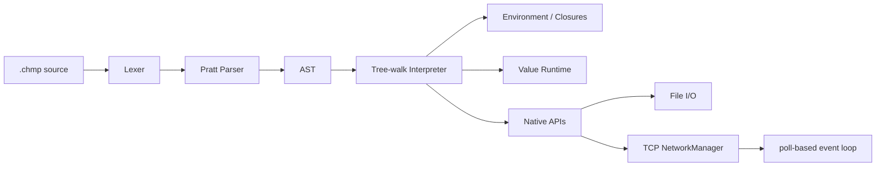

<div align="center">

# Chompo

### Динамический язык и tree-walk интерпретатор на C++23

[](https://en.cppreference.com/w/cpp/23)
[](https://cmake.org/)
[](https://github.com/Bony-Lord/ChompoC/actions/workflows/ci.yml)
[](LICENSE)


**Chompo** — динамически типизированный язык с файлами `.chmp`, функциями первого класса, замыканиями, изменяемыми массивами и строками, файловым I/O и полноценным TCP API (включая реализованный многопользовательский чат).

[Возможности](#-возможности) · [Быстрый старт](#-быстрый-старт) · [Пример](#-пример) · [Синтаксис](#-основной-синтаксис) · [I/O](#-ввод-и-вывод) · [Network API](#-network-api) · [LangJam](#-готовность-к-langjam) · [Roadmap](#-roadmap)

</div>

> [!IMPORTANT]
> Активная ветка разработки — `dev`. Требования LangJam (язык + многопользовательский чат) полностью выполнены.

**English version** → [README.md](README.md)

**Чат на данном языке**→ [README.md](langjam/Chompo/README.md) 

## ✨ Возможности

| Подсистема     | Статус | Возможности |
|----------------|--------|-------------|
| Значения       | ✅     | `NULL`, `bool`, `integer`, `double`, `char`, `string`, `array`, `callable` |
| Переменные     | ✅     | `var`, вложенные scope, обычные и составные присваивания |
| Управление     | ✅     | `if`/`else`, `while`, `for-in`, `break`, `continue` |
| Функции        | ✅     | параметры, `return`, рекурсия, first-class functions, **closures** |
| Коллекции      | ✅     | массивы, индексация, мутация, `len`, `in`, повторение, конкатенация |
| Строки         | ✅     | байтовые `char`, индексация и мутация |
| I/O            | ✅     | `input`, `istream`, `ostream`, `iostream` |
| TCP            | ✅     | listener, client socket, `netPoll`, accept, send, receive, close |
| Чат            | ✅     | многопользовательский чат (сервер + клиент) полностью реализован на Chompo |
| Надёжность     | ✅     | защита от Runtime StackOverflow, запрет циклических массивов, полный набор тестов |
| LangJam        | ✅     | все обязательные требования выполнены |

## 🚀 Быстрый старт

Требуется компилятор с C++23 и CMake 4.2+.

```bash
cmake -S . -B build
cmake --build build --parallel
ctest --test-dir build --output-on-failure
```

**Запуск:**

```bash
./build/Chompo program.chmp
```

**Windows (multi-config):**

```powershell
.\build\Debug\Chompo.exe program.chmp
```

## ⚡ Пример

```javascript
fun sum(values) {
    var result = 0;

    for (var value in values)
        result += value;

    return result;
}

var values = Array{10, 20, 30};
print(sum(values), "\n");
```

## 🧩 Основной синтаксис

```javascript
var value = 10;
value += 5;

if (value > 10) {
    print("large\n");
}

while (value > 0)
    value--;

for (var character in "Chompo") {
    if (character == 'm')
        continue;

    print(character);
}
```

Встроенные преобразования: `Int`, `Double`, `Bool`, `String`, `Char`, `Array`, `CATS`, `Type`.

## 📥 Ввод и вывод

`input()` читает одну строку без `\n`. На EOF возвращает `NULL`.

Стандартный поток обозначается строкой `"standart"` (написание сохранено как часть текущего API).

Поддерживаются режимы файлов: `"rewrite"`, `"append"`, `"create"`.

## 🌐 Network API

Использует TCP-сокеты хоста. Собственная VM не требуется.

**Ключевые функции:** `netListen`, `netConnect`, `netAccept`, `netPoll`, `netSend`, `netReceive` / `netReceiveLine`, `netClose`, `netPort`.

API синхронный, но сокеты неблокирующие. `netPoll` позволяет строить однопоточный event loop для нескольких клиентов.

**Пример минимального echo-сервера:**

```javascript
var listener = netListen("0.0.0.0", 4040);
var clients = Array{};

while (true) {
    var watched = Array{listener} + clients;
    var ready = netPoll(watched, 100);

    for (var handle in ready) {
        if (handle == listener) {
            var client = netAccept(listener);
            if (client != NULL)
                clients += Array{client};
            continue;
        }

        var packet = netReceiveLine(handle);

        if (packet[0] == "data")
            netSend(handle, packet[1] + "\n");
    }
}
```

> [!NOTE]
> Полноценный многопользовательский чат (с командами `/help`, `/history`, `/quit`, timestamps, сохранением истории и корректной обработкой отключений) реализован в `langjam/Chompo/`.

## 🏗 Архитектура



Tree-walk интерпретатор полностью удовлетворяет требованию «компилятор или интерпретатор». Bytecode VM можно добавить позже для производительности.

## 🧪 Тестирование

```bash
ctest --test-dir build --output-on-failure
```

Набор включает golden-тесты, регрессионные тесты ошибок, файловый I/O, TCP loopback и end-to-end тесты чата. GitHub Actions запускает сборку и тесты на Windows и Ubuntu.

## 🏁 Готовность к LangJam

**✅ Все требования выполнены**

- [x] Язык с полной семантикой и синтаксисом
- [x] Многопользовательская чат-комната (сервер + клиент) полностью написана на Chompo
- [x] TCP API с `netPoll`-based event loop
- [x] Автоматические тесты на Windows и Linux

**Дополнительно реализовано** (для баллов по архитектуре и креативности):
- [x] Команды `/help`, `/history`, `/quit`
- [x] Timestamps
- [x] Корректная обработка отключения клиентов
- [x] Сохранение истории через `ostream(..., "append")`

## 🗺 Roadmap

### До LangJam (выполнено)
- [x] Все конструкции управления, I/O, TCP, **многопользовательский чат**
- [x] Submission package и demo

### После LangJam
- [x] `Map`/словари
- [ ] Модули и `import`
- [ ] Exceptions языка
- [ ] Unicode
- [ ] Garbage collector для циклических графов
- [ ] Bytecode VM (только при реальной необходимости производительности)
- [ ] Actors/channels и полноценный async runtime
- [ ] REPL, formatter, LSP и редакторские плагины

## 📄 Лицензия

MIT — см. [LICENSE](LICENSE).
